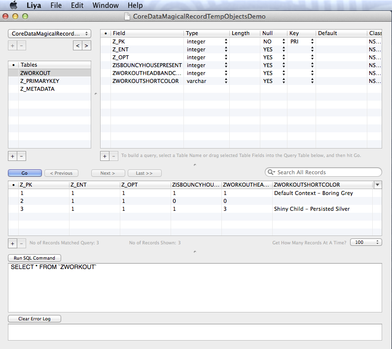

##CoreData+MagicalRecord demo of saving (and not saving) temporary managed objects

This is just a personal demo written after seeing mixed advice on stackoverflow on how to create temporary NSManagedObjects, and how to save them if you decide to keep them. It uses the MagicalRecord Core Data wrapper, but I'd expect similar results without it.

The demo does 4 examples:

1) A baseline save without any use of a temporary object, just creating an object with default context 

2) An attempt to save an object initially created with a nil context, then inserted into the default context. This is often suggested and has a high ranking on stackoverflow, but at least on osx, this results prove it's unreliable as it just creates a record of nil attributes.

3) An attempt to save an object created as a child context, which works by saving the child context.

4) An attempt to create an object in a child context without saving, and is shown to work by trying to save the parent context anyways. 

To run the demo, just open the project, run it, then open ~/Library/Application Support/CoreDataMagicalRecordTempObjectsDemo in a sqlite browser (I used Liya in this example).

###Results

As mentioned, method two of using a nil context then inserting it into a default context loses the attributes we set for it. Method three works. And method four works as the temporary object in the child context is not saved even if we save only the default context.

###More info

References to use method 2 (insert from a nil context):
- http://stackoverflow.com/a/15954967/314780
- http://stackoverflow.com/a/3258470/314780

References to use method 3/4 (create save from a child context):
- http://stackoverflow.com/a/14494126/314780 (which references wwdc 2012 - "core data best practices" ) https://developer.apple.com/videos/wwdc/2012/?id=214

Hope this helps someone else learning Core Data!

#### What's the deal with workout objects and bouncy houses?
See https://www.youtube.com/watch?v=CrycLMsoYjU